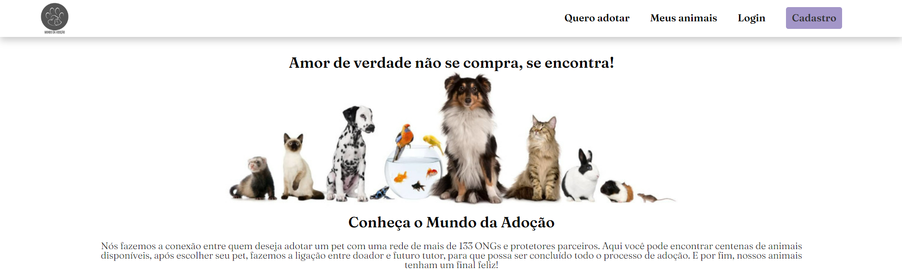

 #  Projeto Desenvolvimento Web - Estacio - Professor Yuri Fialho

   
 

 
 
##### Este repositório foi criado para exibir o Projeto desenvolvido na materia de Desenvolvimento web na faculdade estacio, ministrado pelo professor Yuri fialho. A materia com o intuito de ensinar desenvolvimento web, front-end e back-end.

### 🤔 Requisitos
• Autenticação
• Página de Login
• Todas as chamadas deverão ser
autenticadas, exceto a index e login

### 🤔 Funcionalidades:
• Mínimo 3
• Sendo, 1 CRUD (Completo)
• Não pode ser 3 CRUD
• Validação
• Página (Frontend)
• Servidor (Backend) – Recomenda-se PHP

### Projeto desenvolvido por:
- <a href="https://github.com/kaili0n">Kaillane Mariano</a>
- <a href="https://github.com/Loanecmps">Loane Campos</a>
- <a href="https://github.com/brandaoramon">Ramon Brandão</a>
